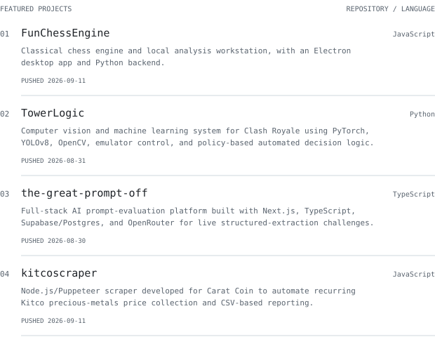

<!-- hero:start -->
<picture>
  <source media="(prefers-color-scheme: dark)" srcset="generated/ascii-dark.svg">
  
</picture>

<!-- hero:end -->

<picture>
  <source media="(prefers-color-scheme: dark)" srcset="generated/identity-dark.svg">
  
</picture>

<picture>
  <source media="(prefers-color-scheme: dark)" srcset="generated/stats-dark.svg">
  
</picture>

<picture>
  <source media="(prefers-color-scheme: dark)" srcset="generated/hd-about-dark.svg">
  
</picture>

I’m Ethan. My public projects span machine learning, music analysis, 
and tools for the web. This page follows the work as it changes.

<picture>
  <source media="(prefers-color-scheme: dark)" srcset="generated/hd-recent-dark.svg">
  
</picture>

<picture>
  <source media="(prefers-color-scheme: dark)" srcset="generated/recent-dark.svg">
  
</picture>

<!-- recent-links:start -->
[FunChessEngine](https://github.com/EthanChenHyland/FunChessEngine) · [TowerLogic](https://github.com/EthanChenHyland/TowerLogic) · [the-great-prompt-off](https://github.com/EthanChenHyland/the-great-prompt-off) · [kitcoscraper](https://github.com/EthanChenHyland/kitcoscraper)
<!-- recent-links:end -->

<picture>
  <source media="(prefers-color-scheme: dark)" srcset="generated/hd-stack-dark.svg">
  
</picture>

<picture>
  <source media="(prefers-color-scheme: dark)" srcset="generated/langs-dark.svg">
  
</picture>

<picture>
  <source media="(prefers-color-scheme: dark)" srcset="generated/hd-stats-dark.svg">
  
</picture>

<picture>
  <source media="(prefers-color-scheme: dark)" srcset="generated/streak-dark.svg">
  
</picture>

<picture>
  <source media="(prefers-color-scheme: dark)" srcset="generated/year-dark.svg">
  
</picture>

Read activity as text

<!-- activity-text:start -->
242 contributions across 22 active days. Best Sunday–Saturday week: 86 contributions. 2025-09-09 through 2026-09-08, UTC.

Current: 1 days (2026-09-08 / 2026-09-08). Longest within the last 365 days: 6 days (2026-08-29 / 2026-09-03).

HTML: 3,831,364 bytes (49.4%), 2 repositories; Python: 1,388,247 bytes (17.9%), 3 repositories; Rust: 1,124,399 bytes (14.5%), 1 repositories; TypeScript: 691,058 bytes (8.9%), 1 repositories; JavaScript: 588,755 bytes (7.6%), 3 repositories; CSS: 95,836 bytes (1.2%), 2 repositories; PLpgSQL: 33,322 bytes (0.4%), 1 repositories; Makefile: 2,330 bytes (0.0%), 1 repositories; Shell: 1,335 bytes (0.0%), 2 repositories

**FunChessEngine** (JavaScript), pushed 2026-09-04. Classical chess engine and local analysis workstation, with an Electron desktop app and Python backend.

**TowerLogic** (Python), pushed 2026-08-31. Computer vision and machine learning system for Clash Royale using PyTorch, YOLOv8, OpenCV, emulator control, and policy-based automated decision logic.

**the-great-prompt-off** (TypeScript), pushed 2026-08-30. Full-stack AI prompt-evaluation platform built with Next.js, TypeScript, Supabase/Postgres, and OpenRouter for live structured-extraction challenges.

**kitcoscraper** (JavaScript), pushed 2026-08-30. Node.js/Puppeteer scraper developed for Carat Coin to automate recurring Kitco precious-metals price collection and CSV-based reporting.
<!-- activity-text:end -->

[Daily contribution data](generated/activity.json)

