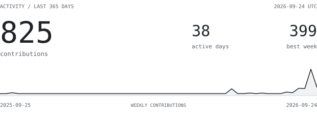
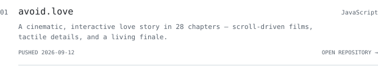
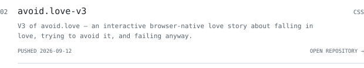
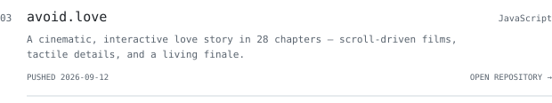
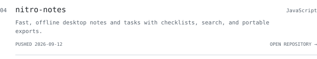
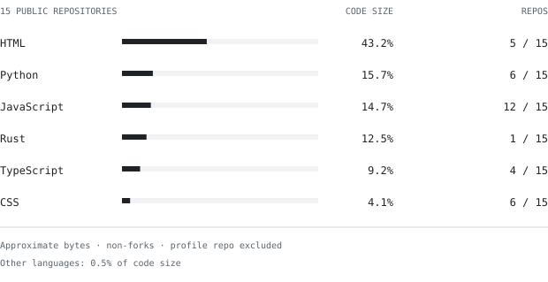
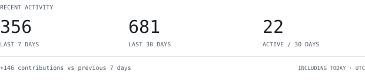
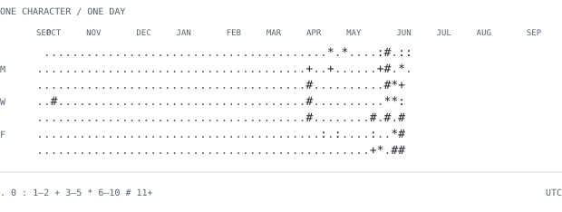

<!-- hero:start -->
<picture>
  <source media="(prefers-color-scheme: dark)" srcset="generated/ascii-dark.svg">
  
</picture>

<!-- hero:end -->

<picture>
  <source media="(prefers-color-scheme: dark)" srcset="generated/identity-dark.svg">
  
</picture>

<samp><a href="#user-content-work">WORK</a> · <a href="#user-content-languages">LANGUAGES</a> · <a href="#user-content-activity">ACTIVITY</a></samp>

<picture>
  <source media="(prefers-color-scheme: dark)" srcset="generated/stats-dark.svg">
  
</picture>

<picture>
  <source media="(prefers-color-scheme: dark)" srcset="generated/hd-about-dark.svg">
  
</picture>

I’m Ethan. My public projects span machine learning, music analysis, 
and tools for the web. This page follows the work as it changes.

<picture>
  <source media="(prefers-color-scheme: dark)" srcset="generated/hd-recent-dark.svg">
  
</picture>

<!-- recent-links:start -->
<a href="https://github.com/EthanChenHyland/FunChessEngine" title="Open FunChessEngine">
<picture>
  <source media="(prefers-color-scheme: dark)" srcset="generated/work-1-dark.svg">
  
</picture>
</a>

<samp>EXPLORE FunChessEngine</samp>

Classical chess engine and local analysis workstation, with an Electron desktop app and Python backend.

<b>Languages:</b> JavaScript · Python · HTML · CSS · Makefile · Shell

<b>Latest default-branch commit:</b> <a href="https://github.com/EthanChenHyland/FunChessEngine/commit/daa903d736592c49f0e861ad4cc3fb7ece826933">Harden desktop preference recovery</a> 2026-09-04 UTC

<samp><a href="https://github.com/EthanChenHyland/FunChessEngine">Code</a> · <a href="https://github.com/EthanChenHyland/FunChessEngine/commits/main">Commits</a> · <a href="https://github.com/EthanChenHyland/FunChessEngine/releases">Releases</a> · <a href="https://github.com/EthanChenHyland/FunChessEngine/issues">Issues</a></samp>

<a href="https://github.com/EthanChenHyland/TowerLogic" title="Open TowerLogic">
<picture>
  <source media="(prefers-color-scheme: dark)" srcset="generated/work-2-dark.svg">
  
</picture>
</a>

<samp>EXPLORE TowerLogic</samp>

Computer vision and machine learning system for Clash Royale using PyTorch, YOLOv8, OpenCV, emulator control, and policy-based automated decision logic.

<b>Languages:</b> Python · Shell

<b>Latest default-branch commit:</b> <a href="https://github.com/EthanChenHyland/TowerLogic/commit/33ed84c8ba47a0a407af763c917128cfbc4a8e29">Fix stuck on Menu Issue</a> 2026-08-31 UTC

<samp><a href="https://github.com/EthanChenHyland/TowerLogic">Code</a> · <a href="https://github.com/EthanChenHyland/TowerLogic/commits/main">Commits</a> · <a href="https://github.com/EthanChenHyland/TowerLogic/releases">Releases</a> · <a href="https://github.com/EthanChenHyland/TowerLogic/issues">Issues</a></samp>

<a href="https://github.com/EthanChenHyland/the-great-prompt-off" title="Open the-great-prompt-off">
<picture>
  <source media="(prefers-color-scheme: dark)" srcset="generated/work-3-dark.svg">
  
</picture>
</a>

<samp>EXPLORE the-great-prompt-off</samp>

Full-stack AI prompt-evaluation platform built with Next.js, TypeScript, Supabase/Postgres, and OpenRouter for live structured-extraction challenges.

<b>Languages:</b> TypeScript · PLpgSQL · JavaScript · CSS

<b>Latest default-branch commit:</b> <a href="https://github.com/EthanChenHyland/the-great-prompt-off/commit/02b472c7a15143398f089dbd99fbf69cbb947f0c">Comprehensive passthrough of README and MIT license</a> 2026-08-30 UTC

<samp><a href="https://github.com/EthanChenHyland/the-great-prompt-off">Code</a> · <a href="https://github.com/EthanChenHyland/the-great-prompt-off/commits/main">Commits</a> · <a href="https://github.com/EthanChenHyland/the-great-prompt-off/releases">Releases</a> · <a href="https://github.com/EthanChenHyland/the-great-prompt-off/issues">Issues</a></samp>

<a href="https://github.com/EthanChenHyland/kitcoscraper" title="Open kitcoscraper">
<picture>
  <source media="(prefers-color-scheme: dark)" srcset="generated/work-4-dark.svg">
  
</picture>
</a>

<samp>EXPLORE kitcoscraper</samp>

Node.js/Puppeteer scraper developed for Carat Coin to automate recurring Kitco precious-metals price collection and CSV-based reporting.

<b>Languages:</b> JavaScript

<b>Latest default-branch commit:</b> <a href="https://github.com/EthanChenHyland/kitcoscraper/commit/09bf8caa781ae8a2df8e5cbb87110b7aa5577b99">Revise README for clarity and detail</a> 2026-08-30 UTC

<samp><a href="https://github.com/EthanChenHyland/kitcoscraper">Code</a> · <a href="https://github.com/EthanChenHyland/kitcoscraper/commits/main">Commits</a> · <a href="https://github.com/EthanChenHyland/kitcoscraper/releases">Releases</a> · <a href="https://github.com/EthanChenHyland/kitcoscraper/issues">Issues</a></samp>

<!-- recent-links:end -->

<!-- project-index:start -->

<samp>BROWSE ALL 6 PROJECTS</samp>

Public, non-fork projects, grouped by primary language.

<ul>
<li><a href="https://github.com/EthanChenHyland/wifi-concierge-site">wifi-concierge-site</a> — HTML</li>
<li><a href="https://github.com/EthanChenHyland/FunChessEngine">FunChessEngine</a> — JavaScript</li>
<li><a href="https://github.com/EthanChenHyland/kitcoscraper">kitcoscraper</a> — JavaScript</li>
<li><a href="https://github.com/EthanChenHyland/TowerLogic">TowerLogic</a> — Python</li>
<li><a href="https://github.com/EthanChenHyland/PianoMirRustPublic">PianoMirRustPublic</a> — Rust</li>
<li><a href="https://github.com/EthanChenHyland/the-great-prompt-off">the-great-prompt-off</a> — TypeScript</li>
</ul>

<!-- project-index:end -->

<picture>
  <source media="(prefers-color-scheme: dark)" srcset="generated/hd-stack-dark.svg">
  
</picture>

<picture>
  <source media="(prefers-color-scheme: dark)" srcset="generated/langs-dark.svg">
  
</picture>

<picture>
  <source media="(prefers-color-scheme: dark)" srcset="generated/hd-stats-dark.svg">
  
</picture>

<picture>
  <source media="(prefers-color-scheme: dark)" srcset="generated/pulse-dark.svg">
  
</picture>

<picture>
  <source media="(prefers-color-scheme: dark)" srcset="generated/streak-dark.svg">
  
</picture>

<picture>
  <source media="(prefers-color-scheme: dark)" srcset="generated/year-dark.svg">
  
</picture>

<samp>EXPLORE THE NUMBERS</samp>

<!-- activity-text:start -->
247 contributions across 22 active days. Best Sunday–Saturday week: 86 contributions. 2025-09-10 through 2026-09-09, UTC.

Current: 1 day (2026-09-08 / 2026-09-08). Longest within the last 365 days: 6 days (2026-08-29 / 2026-09-03).

Last 7 UTC days: 33 contributions; previous 7 days: 70; last 30 days: 133 contributions over 12 active days. Includes today, which is unfinished.

**Languages**

- HTML: 3,831,364 bytes (49.4%), 2 repositories
- Python: 1,388,247 bytes (17.9%), 3 repositories
- Rust: 1,124,399 bytes (14.5%), 1 repositories
- TypeScript: 691,058 bytes (8.9%), 1 repositories
- JavaScript: 588,755 bytes (7.6%), 3 repositories
- CSS: 95,836 bytes (1.2%), 2 repositories
- PLpgSQL: 33,322 bytes (0.4%), 1 repositories
- Makefile: 2,330 bytes (0.0%), 1 repositories
- Shell: 1,335 bytes (0.0%), 2 repositories

**Recent work**

**FunChessEngine** (JavaScript), pushed 2026-09-04. Classical chess engine and local analysis workstation, with an Electron desktop app and Python backend.

**TowerLogic** (Python), pushed 2026-08-31. Computer vision and machine learning system for Clash Royale using PyTorch, YOLOv8, OpenCV, emulator control, and policy-based automated decision logic.

**the-great-prompt-off** (TypeScript), pushed 2026-08-30. Full-stack AI prompt-evaluation platform built with Next.js, TypeScript, Supabase/Postgres, and OpenRouter for live structured-extraction challenges.

**kitcoscraper** (JavaScript), pushed 2026-08-30. Node.js/Puppeteer scraper developed for Carat Coin to automate recurring Kitco precious-metals price collection and CSV-based reporting.
<!-- activity-text:end -->

[Daily contribution data](generated/activity.json)

