

<!-- hero:start -->
<picture>
  <source media="(prefers-color-scheme: dark)" srcset="generated/ascii-dark.svg">
  
</picture>

<!-- hero:end -->

<picture>
  <source media="(prefers-color-scheme: dark)" srcset="generated/identity-dark.svg">
  
</picture>

<samp><a href="#user-content-work">WORK</a> · <a href="#user-content-puzzle">DAILY PUZZLE</a> · <a href="#user-content-more-fun-stuff">MORE FUN STUFF</a> · <a href="#user-content-languages">LANGUAGES</a> · <a href="#user-content-activity">ACTIVITY</a></samp>

<picture>
  <source media="(prefers-color-scheme: dark)" srcset="generated/stats-dark.svg">
  
</picture>

<picture>
  <source media="(prefers-color-scheme: dark)" srcset="generated/hd-about-dark.svg">
  
</picture>

I’m Ethan. My public projects span machine learning, music analysis, 
and tools for the web. This page follows the work as it changes.

<!-- discovery:start -->

<samp>THE FROG PICKED A PROJECT FOR YOU</samp>

<b><a href="https://github.com/EthanChenHyland/wifi-concierge-site">wifi-concierge-site</a></b>

Public website for Wifi Concierge, a social-impact initiative focused on digital access, device integration, and community technology support.

A rotating daily spotlight · 2026-09-12 UTC

<!-- discovery:end -->

<a href="https://www.ethanbchen.com/github">
<picture>
  <source media="(prefers-color-scheme: dark)" srcset="generated/pond-dark.svg">
  
</picture>
</a>

<samp><a href="https://www.ethanbchen.com/github">ENTER THE POND ↗ · PLAY / TERMINAL / DEMOS</a></samp>

<!-- profile-extras:start -->

<picture>
  <source media="(prefers-color-scheme: dark)" srcset="generated/puzzle-dark.svg">
  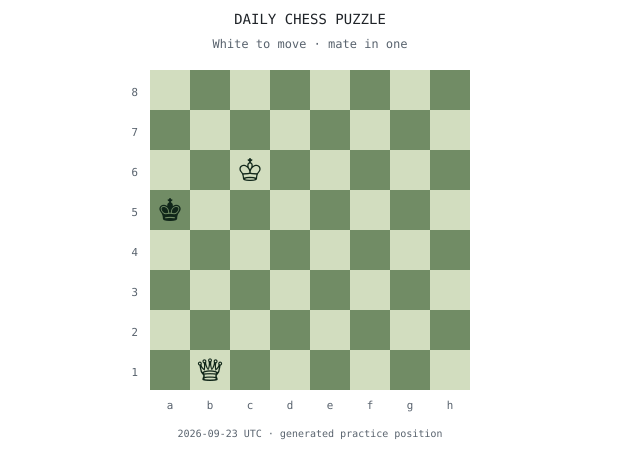
</picture>

<samp>NEED A HINT?</samp>

The queen delivers mate on rank <b>1</b>. Look for a square that checks the king and removes its escape squares.

<samp>REVEAL THE MOVE</samp>

<b>Qd1#</b> — move the queen from <b>g4</b> to <b>d1</b>. The black king is in check with no legal escape.

One of 16 verified practice positions, rotating daily. # means checkmate.

<samp>MORE FUN STUFF</samp>

<samp>OPEN THE 7-DAY ACTIVITY DIARY · 34 CONTRIBUTIONS</samp>

<table><thead><tr><th>Date (UTC)</th><th>Contributions</th></tr></thead><tbody><tr><td>2026-09-12</td><td>8</td></tr><tr><td>2026-09-11</td><td>9</td></tr><tr><td>2026-09-10</td><td>0</td></tr><tr><td>2026-09-09</td><td>7</td></tr><tr><td>2026-09-08</td><td>10</td></tr><tr><td>2026-09-07</td><td>0</td></tr><tr><td>2026-09-06</td><td>0</td></tr></tbody></table>

GitHub contribution-calendar counts, updated with the profile. The current UTC day may be incomplete.

<samp>THE FIELD GUIDE · OPEN SOMETHING THAT INTERESTS YOU</samp>

<samp>CHOOSE YOUR PATH</samp>

Pick an interest to find a starting point in my work.

<samp>I LIKE GAMES &amp; SEARCH</samp>

<b>FunChessEngine</b>

Follow a position from legal moves to search to evaluation. The recorded self-play demo below shows the engine choosing for both sides.

JavaScript · Python · HTML · CSS · Makefile · Shell · latest push 2026-09-11

<samp>I LIKE MUSIC &amp; SIGNALS</samp>

<b>PianoMirRustPublic</b>

Follow audio through pitch evidence and alignment with a known score. Open the lab results below to see what the captured example actually measured.

Rust · Python · latest push 2026-08-30

<samp>I LIKE DATA &amp; AUTOMATION</samp>

<b>kitcoscraper</b>

Explore the path from a web source to extracted data. The project notes show its latest public change.

JavaScript · latest push 2026-09-11

<samp>I LIKE AI EXPERIMENTS</samp>

<b>the-great-prompt-off</b>

Explore a project organized around comparing prompts. The project browser below contains its current languages and latest public activity.

TypeScript · PLpgSQL · JavaScript · CSS · latest push 2026-08-30

<samp>OPEN THE MUSIC ANALYSIS LAB</samp>

One captured experiment: a 12-second synthesized Minuet excerpt compared with its source score.
<table><tr><th>Measurement</th><th>Result</th><th>Meaning</th></tr><tr><td>Score-aligned verification</td><td>94.78 / 100</td><td>Overall evidence that this audio matches its known score.</td></tr><tr><td>Note score</td><td>99.86</td><td>Note matching component of this captured run.</td></tr><tr><td>Timing score</td><td>96.01</td><td>Timing alignment component.</td></tr><tr><td>Chroma score</td><td>66.95</td><td>Pitch-class evidence component.</td></tr><tr><td>Missing notes</td><td>0</td><td>Missing notes reported by this run.</td></tr></table>

<samp>WHAT DOES 94.78 ACTUALLY MEAN?</samp>

The system was given the score. It checks whether the audio agrees with that score. These component scores are separate measurements, not percentages to add together.

This result does not measure a pianist’s skill or prove that the system can transcribe unfamiliar music. The input is synthesized, with no human performance.

<samp>THIS WEEK IN NUMBERS</samp>

<b>34 contributions</b> across 4 active days.

-52 contributions compared with the preceding seven days (86).

Busiest day: 2026-09-08 (10 contributions).

2026-09-06 through 2026-09-12 UTC. The current day may be incomplete. Activity counts describe frequency, not code quality.

<samp>THE CHESS CORNER · 16 CHALLENGES</samp>

Fixed practice positions from the verified puzzle collection, grouped in sets of four. White to move, mate in one. Open a board, solve it, then check your answer. Each position has exactly one mating move.

<samp>PUZZLES 01–04</samp>

<samp>CHALLENGE 01</samp>

<picture><source media="(prefers-color-scheme: dark)" srcset="generated/challenge-1-dark.svg">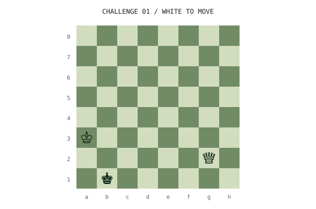</picture>

<samp>SHOW A HINT</samp>

Look for a queen move to the b-file.

<samp>CHECK YOUR ANSWER</samp>

<b>Qb2#</b> — queen from g2 to b2. The king is checked and has no legal reply.

<samp>CHALLENGE 02</samp>

<picture><source media="(prefers-color-scheme: dark)" srcset="generated/challenge-2-dark.svg">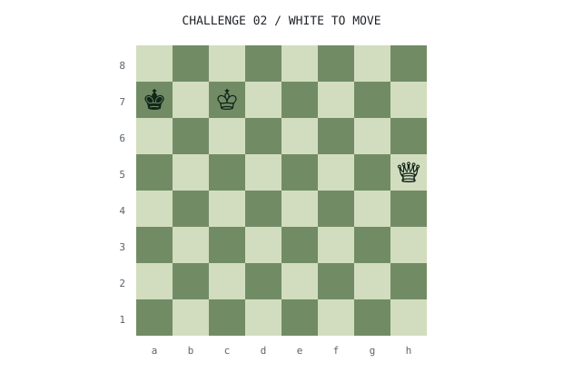</picture>

<samp>SHOW A HINT</samp>

Look for a queen move to the a-file.

<samp>CHECK YOUR ANSWER</samp>

<b>Qa5#</b> — queen from h5 to a5. The king is checked and has no legal reply.

<samp>CHALLENGE 03</samp>

<picture><source media="(prefers-color-scheme: dark)" srcset="generated/challenge-3-dark.svg">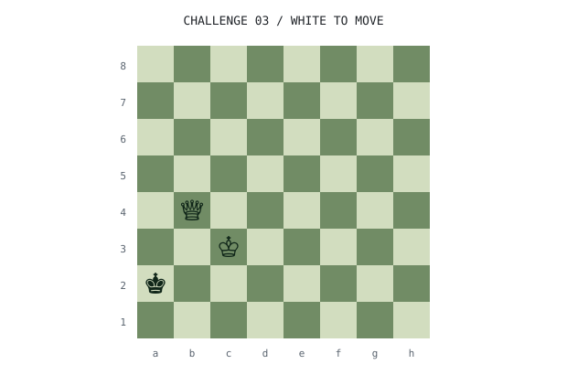</picture>

<samp>SHOW A HINT</samp>

Look for a queen move to the b-file.

<samp>CHECK YOUR ANSWER</samp>

<b>Qb2#</b> — queen from b4 to b2. The king is checked and has no legal reply.

<samp>CHALLENGE 04</samp>

<picture><source media="(prefers-color-scheme: dark)" srcset="generated/challenge-4-dark.svg">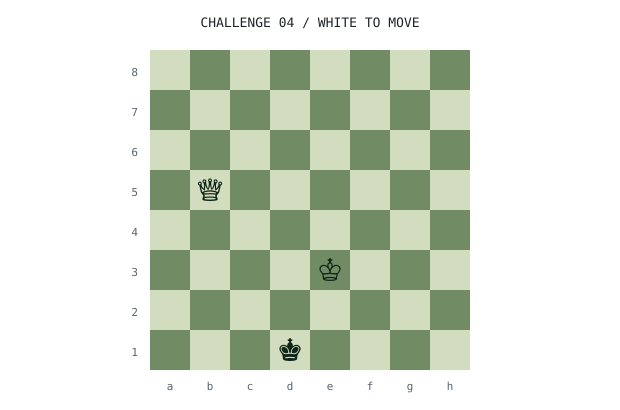</picture>

<samp>SHOW A HINT</samp>

Look for a queen move to the b-file.

<samp>CHECK YOUR ANSWER</samp>

<b>Qb1#</b> — queen from b5 to b1. The king is checked and has no legal reply.

<samp>PUZZLES 05–08</samp>

<samp>CHALLENGE 05</samp>

<picture><source media="(prefers-color-scheme: dark)" srcset="generated/challenge-5-dark.svg">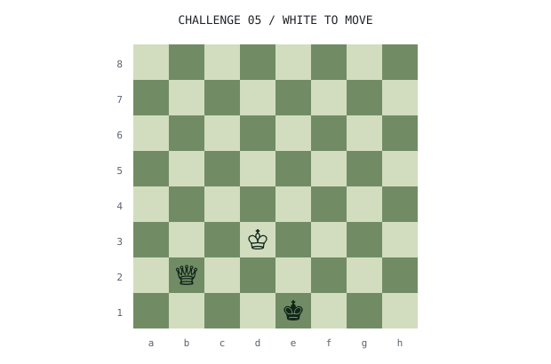</picture>

<samp>SHOW A HINT</samp>

Look for a queen move to the e-file.

<samp>CHECK YOUR ANSWER</samp>

<b>Qe2#</b> — queen from b2 to e2. The king is checked and has no legal reply.

<samp>CHALLENGE 06</samp>

<picture><source media="(prefers-color-scheme: dark)" srcset="generated/challenge-6-dark.svg">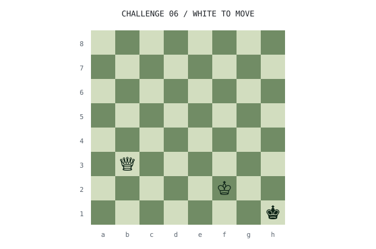</picture>

<samp>SHOW A HINT</samp>

Look for a queen move to the h-file.

<samp>CHECK YOUR ANSWER</samp>

<b>Qh3#</b> — queen from b3 to h3. The king is checked and has no legal reply.

<samp>CHALLENGE 07</samp>

<picture><source media="(prefers-color-scheme: dark)" srcset="generated/challenge-7-dark.svg">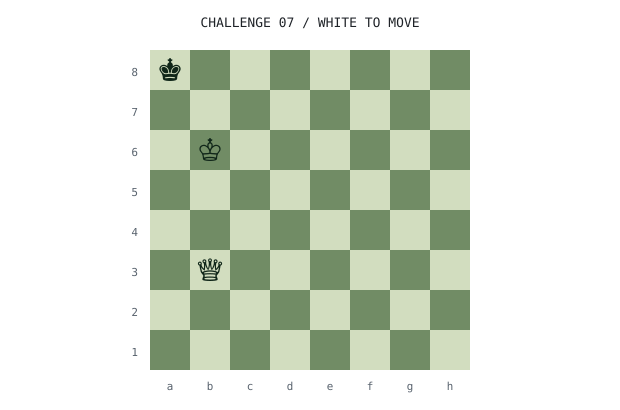</picture>

<samp>SHOW A HINT</samp>

Look for a queen move to the g-file.

<samp>CHECK YOUR ANSWER</samp>

<b>Qg8#</b> — queen from b3 to g8. The king is checked and has no legal reply.

<samp>CHALLENGE 08</samp>

<picture><source media="(prefers-color-scheme: dark)" srcset="generated/challenge-8-dark.svg">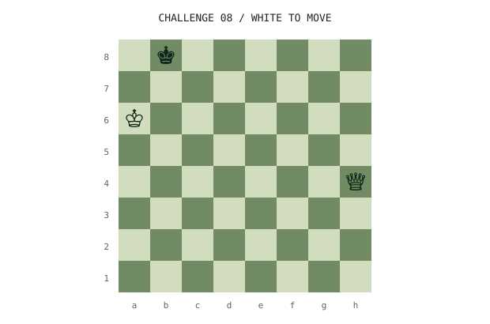</picture>

<samp>SHOW A HINT</samp>

Look for a queen move to the d-file.

<samp>CHECK YOUR ANSWER</samp>

<b>Qd8#</b> — queen from h4 to d8. The king is checked and has no legal reply.

<samp>PUZZLES 09–12</samp>

<samp>CHALLENGE 09</samp>

<picture><source media="(prefers-color-scheme: dark)" srcset="generated/challenge-9-dark.svg">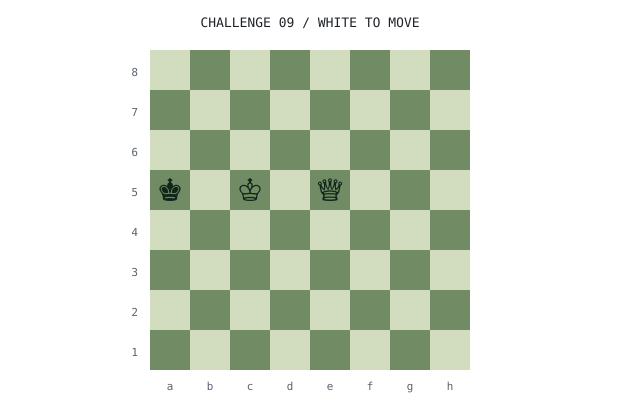</picture>

<samp>SHOW A HINT</samp>

Look for a queen move to the a-file.

<samp>CHECK YOUR ANSWER</samp>

<b>Qa1#</b> — queen from e5 to a1. The king is checked and has no legal reply.

<samp>CHALLENGE 10</samp>

<picture><source media="(prefers-color-scheme: dark)" srcset="generated/challenge-10-dark.svg">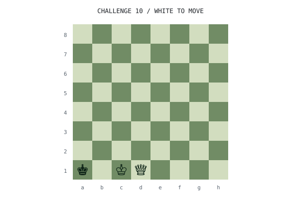</picture>

<samp>SHOW A HINT</samp>

Look for a queen move to the a-file.

<samp>CHECK YOUR ANSWER</samp>

<b>Qa4#</b> — queen from d1 to a4. The king is checked and has no legal reply.

<samp>CHALLENGE 11</samp>

<picture><source media="(prefers-color-scheme: dark)" srcset="generated/challenge-11-dark.svg">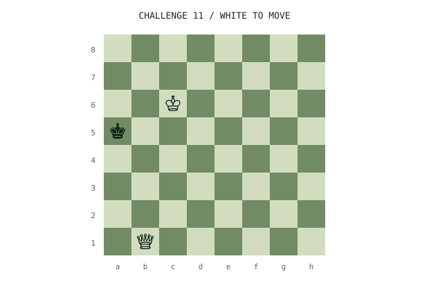</picture>

<samp>SHOW A HINT</samp>

Look for a queen move to the b-file.

<samp>CHECK YOUR ANSWER</samp>

<b>Qb5#</b> — queen from b1 to b5. The king is checked and has no legal reply.

<samp>CHALLENGE 12</samp>

<picture><source media="(prefers-color-scheme: dark)" srcset="generated/challenge-12-dark.svg">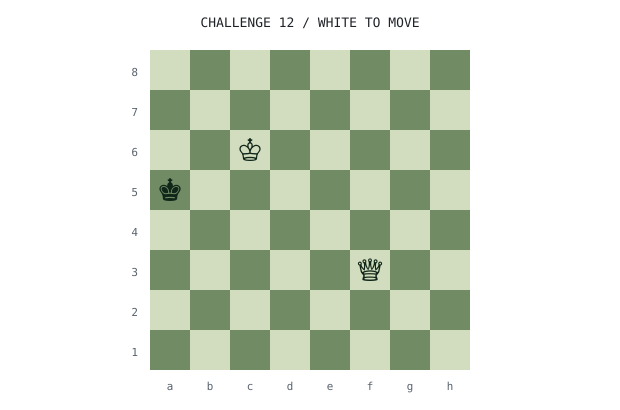</picture>

<samp>SHOW A HINT</samp>

Look for a queen move to the a-file.

<samp>CHECK YOUR ANSWER</samp>

<b>Qa3#</b> — queen from f3 to a3. The king is checked and has no legal reply.

<samp>PUZZLES 13–16</samp>

<samp>CHALLENGE 13</samp>

<picture><source media="(prefers-color-scheme: dark)" srcset="generated/challenge-13-dark.svg">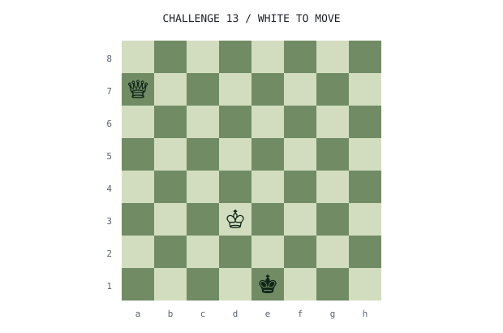</picture>

<samp>SHOW A HINT</samp>

Look for a queen move to the g-file.

<samp>CHECK YOUR ANSWER</samp>

<b>Qg1#</b> — queen from a7 to g1. The king is checked and has no legal reply.

<samp>CHALLENGE 14</samp>

<picture><source media="(prefers-color-scheme: dark)" srcset="generated/challenge-14-dark.svg">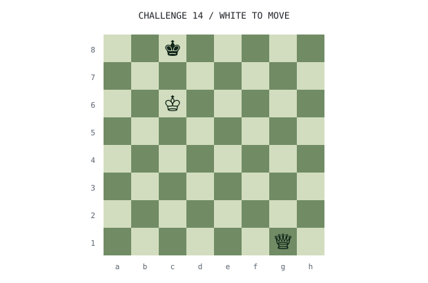</picture>

<samp>SHOW A HINT</samp>

Look for a queen move to the g-file.

<samp>CHECK YOUR ANSWER</samp>

<b>Qg8#</b> — queen from g1 to g8. The king is checked and has no legal reply.

<samp>CHALLENGE 15</samp>

<picture><source media="(prefers-color-scheme: dark)" srcset="generated/challenge-15-dark.svg">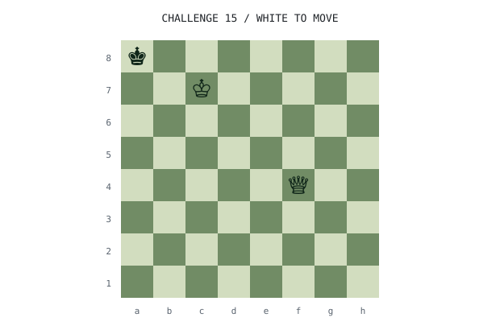</picture>

<samp>SHOW A HINT</samp>

Look for a queen move to the a-file.

<samp>CHECK YOUR ANSWER</samp>

<b>Qa4#</b> — queen from f4 to a4. The king is checked and has no legal reply.

<samp>CHALLENGE 16</samp>

<picture><source media="(prefers-color-scheme: dark)" srcset="generated/challenge-16-dark.svg">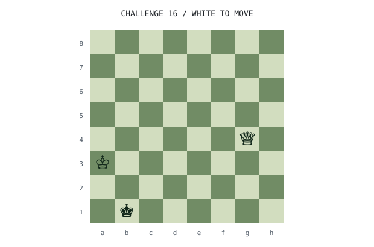</picture>

<samp>SHOW A HINT</samp>

Look for a queen move to the d-file.

<samp>CHECK YOUR ANSWER</samp>

<b>Qd1#</b> — queen from g4 to d1. The king is checked and has no legal reply.

<samp>THE BUILD LOG · LATEST CHANGE IN EACH PROJECT</samp>

An automatically refreshed snapshot of each project’s latest default-branch commit, newest dates first.
<table><tr><th>UTC date</th><th>Project</th><th>Latest change</th></tr><tr><td>2026-09-12</td><td>outlook-electron</td><td>Publish modernized Outlook Electron client with macOS build setup</td></tr><tr><td>2026-09-12</td><td>nitro-notes</td><td>Publish Nitro Notes desktop notes and tasks app</td></tr><tr><td>2026-09-12</td><td>grok-electron</td><td>Document downloadable macOS releases</td></tr><tr><td>2026-09-12</td><td>chatgpt-web</td><td>Initial release of ChatGPT Web for macOS</td></tr><tr><td>2026-09-12</td><td>avoid.love-v3</td><td>correct project identity to avoid.love v3</td></tr><tr><td>2026-09-12</td><td>avoid.love-v2</td><td>docs: introduce avoid.love v2 and document local development</td></tr><tr><td>2026-09-12</td><td>avoid.love-v1</td><td>docs: clarify v1 archive context</td></tr><tr><td>2026-09-12</td><td>avoid.love</td><td>Give the first Us photograph more scroll time</td></tr><tr><td>2026-09-11</td><td>FunChessEngine</td><td>Publish cross-platform tagged releases</td></tr><tr><td>2026-08-31</td><td>TowerLogic</td><td>Fix stuck on Menu Issue</td></tr><tr><td>2026-08-30</td><td>wifi-concierge-site</td><td>Remove image section from README</td></tr><tr><td>2026-08-30</td><td>the-great-prompt-off</td><td>Comprehensive passthrough of README and MIT license</td></tr><tr><td>2026-08-30</td><td>kitcoscraper</td><td>Revise README for clarity and detail</td></tr><tr><td>2026-08-30</td><td>PianoMirRustPublic</td><td>Correct typo in README.md</td></tr></table>

<samp>THREE THINGS THE DEMOS DO NOT TELL YOU</samp>

Make a prediction before opening each answer.

<samp>01 · DOES A HIGH MUSIC MATCH SCORE MEAN GREAT PLAYING?</samp>

No. This example measures agreement with a known score on synthesized audio. It does not grade a human performance.

<samp>02 · DOES MORE CODE IN A LANGUAGE MEAN MORE EXPERTISE?</samp>

No. The language charts measure bytes in public repositories. They describe the codebase, not proficiency.

<samp>03 · DOES SEARCHING MORE CHESS POSITIONS GUARANTEE A BETTER MOVE?</samp>

No. Search depth, evaluation quality, move ordering, and the position itself all matter. A node count alone does not measure move quality.

<samp>A TINY FROG ADVENTURE</samp>

You arrive at the pond at dusk. A path forks between glowing reeds and a checkered stone. Open a choice, then choose again.

<samp>FOLLOW THE FIREFLIES</samp>

The lights blink in pairs. Beneath the reeds, a tiny frog is trying to debug the moon’s reflection.

<samp>OFFER A RUBBER DUCK</samp>

“It only breaks when I look at it,” says the frog. The duck says nothing. The frog solves it anyway.

<b>Ending: honorary pond debugger.</b> 🦆

<samp>WAIT QUIETLY</samp>

The water settles. The moon becomes round again. Some bugs are ripples.

<b>Ending: a moment of peace.</b> 🌙

<samp>INVESTIGATE THE CHECKERED STONE</samp>

A beetle guards a tiny chessboard. “One move,” it says. “Then you may pass.”

<samp>CHALLENGE THE BEETLE</samp>

The beetle pushes a pawn sideways. You politely explain the rules. It insists this is a variant.

<b>Ending: undefeated by technicality.</b> ♟

<samp>ASK FOR DIRECTIONS</samp>

The beetle points toward the Chess Corner above. “Those positions have actually been checked.”

<b>Ending: a sensible detour.</b> 🐸

A little fictional detour. Close the choices to start again; nothing is saved.

<samp>FIND PROJECTS BY LANGUAGE</samp>

Choose a language to see every matching public project. Percentages describe that language’s share of each repository’s detected language bytes.

<samp>CSS · 5 PROJECTS</samp>

<table><tr><th>Project</th><th>Share of language bytes</th><th>Latest push · UTC</th></tr><tr><td>avoid.love</td><td>4.5%</td><td>2026-09-12</td></tr><tr><td>avoid.love-v2</td><td>73.1%</td><td>2026-09-12</td></tr><tr><td>avoid.love-v3</td><td>56.5%</td><td>2026-09-12</td></tr><tr><td>FunChessEngine</td><td>7.1%</td><td>2026-09-11</td></tr><tr><td>the-great-prompt-off</td><td>0.1%</td><td>2026-08-30</td></tr></table>

<samp>HTML · 4 PROJECTS</samp>

<table><tr><th>Project</th><th>Share of language bytes</th><th>Latest push · UTC</th></tr><tr><td>avoid.love</td><td>7.3%</td><td>2026-09-12</td></tr><tr><td>FunChessEngine</td><td>7.5%</td><td>2026-09-11</td></tr><tr><td>nitro-notes</td><td>20.5%</td><td>2026-09-12</td></tr><tr><td>wifi-concierge-site</td><td>100.0%</td><td>2026-08-30</td></tr></table>

<samp>JAVASCRIPT · 11 PROJECTS</samp>

<table><tr><th>Project</th><th>Share of language bytes</th><th>Latest push · UTC</th></tr><tr><td>avoid.love</td><td>83.0%</td><td>2026-09-12</td></tr><tr><td>avoid.love-v1</td><td>1.4%</td><td>2026-09-12</td></tr><tr><td>avoid.love-v2</td><td>0.2%</td><td>2026-09-12</td></tr><tr><td>avoid.love-v3</td><td>0.2%</td><td>2026-09-12</td></tr><tr><td>chatgpt-web</td><td>79.5%</td><td>2026-09-12</td></tr><tr><td>FunChessEngine</td><td>43.3%</td><td>2026-09-11</td></tr><tr><td>grok-electron</td><td>83.2%</td><td>2026-09-12</td></tr><tr><td>kitcoscraper</td><td>100.0%</td><td>2026-09-11</td></tr><tr><td>nitro-notes</td><td>76.9%</td><td>2026-09-12</td></tr><tr><td>outlook-electron</td><td>100.0%</td><td>2026-09-12</td></tr><tr><td>the-great-prompt-off</td><td>0.1%</td><td>2026-08-30</td></tr></table>

<samp>MAKEFILE · 1 PROJECT</samp>

<table><tr><th>Project</th><th>Share of language bytes</th><th>Latest push · UTC</th></tr><tr><td>FunChessEngine</td><td>0.2%</td><td>2026-09-11</td></tr></table>

<samp>PLPGSQL · 1 PROJECT</samp>

<table><tr><th>Project</th><th>Share of language bytes</th><th>Latest push · UTC</th></tr><tr><td>the-great-prompt-off</td><td>4.6%</td><td>2026-08-30</td></tr></table>

<samp>PYTHON · 6 PROJECTS</samp>

<table><tr><th>Project</th><th>Share of language bytes</th><th>Latest push · UTC</th></tr><tr><td>avoid.love</td><td>5.2%</td><td>2026-09-12</td></tr><tr><td>avoid.love-v3</td><td>4.2%</td><td>2026-09-12</td></tr><tr><td>FunChessEngine</td><td>41.8%</td><td>2026-09-11</td></tr><tr><td>nitro-notes</td><td>2.6%</td><td>2026-09-12</td></tr><tr><td>PianoMirRustPublic</td><td>2.6%</td><td>2026-08-30</td></tr><tr><td>TowerLogic</td><td>100.0%</td><td>2026-08-31</td></tr></table>

<samp>RUST · 1 PROJECT</samp>

<table><tr><th>Project</th><th>Share of language bytes</th><th>Latest push · UTC</th></tr><tr><td>PianoMirRustPublic</td><td>97.4%</td><td>2026-08-30</td></tr></table>

<samp>SHELL · 2 PROJECTS</samp>

<table><tr><th>Project</th><th>Share of language bytes</th><th>Latest push · UTC</th></tr><tr><td>FunChessEngine</td><td>0.1%</td><td>2026-09-11</td></tr><tr><td>TowerLogic</td><td>0.0%</td><td>2026-08-31</td></tr></table>

<samp>SWIFT · 2 PROJECTS</samp>

<table><tr><th>Project</th><th>Share of language bytes</th><th>Latest push · UTC</th></tr><tr><td>chatgpt-web</td><td>20.5%</td><td>2026-09-12</td></tr><tr><td>grok-electron</td><td>16.8%</td><td>2026-09-12</td></tr></table>

<samp>TYPESCRIPT · 4 PROJECTS</samp>

<table><tr><th>Project</th><th>Share of language bytes</th><th>Latest push · UTC</th></tr><tr><td>avoid.love-v1</td><td>98.6%</td><td>2026-09-12</td></tr><tr><td>avoid.love-v2</td><td>26.7%</td><td>2026-09-12</td></tr><tr><td>avoid.love-v3</td><td>39.1%</td><td>2026-09-12</td></tr><tr><td>the-great-prompt-off</td><td>95.3%</td><td>2026-08-30</td></tr></table>

<samp>THE YEAR, MONTH BY MONTH</samp>

Open a month to see its activity and three busiest dates. Boundary months cover only the dates included in the rolling 365-day snapshot; today may be incomplete.

<samp>SEPTEMBER 2026 · 85 CONTRIBUTIONS</samp>

7 active days across 12 days in the snapshot.
<table><tr><th>Most active dates</th><th>Contributions</th></tr><tr><td>2026-09-03</td><td>26</td></tr><tr><td>2026-09-01</td><td>18</td></tr><tr><td>2026-09-08</td><td>10</td></tr></table>
Coverage: 2026-09-01 through 2026-09-12 UTC.

<samp>AUGUST 2026 · 75 CONTRIBUTIONS</samp>

8 active days across 31 days in the snapshot.
<table><tr><th>Most active dates</th><th>Contributions</th></tr><tr><td>2026-08-20</td><td>21</td></tr><tr><td>2026-08-30</td><td>18</td></tr><tr><td>2026-08-31</td><td>17</td></tr></table>
Coverage: 2026-08-01 through 2026-08-31 UTC.

<samp>JULY 2026 · 21 CONTRIBUTIONS</samp>

5 active days across 31 days in the snapshot.
<table><tr><th>Most active dates</th><th>Contributions</th></tr><tr><td>2026-07-19</td><td>9</td></tr><tr><td>2026-07-05</td><td>6</td></tr><tr><td>2026-07-06</td><td>4</td></tr></table>
Coverage: 2026-07-01 through 2026-07-31 UTC.

<samp>JUNE 2026 · 78 CONTRIBUTIONS</samp>

4 active days across 30 days in the snapshot.
<table><tr><th>Most active dates</th><th>Contributions</th></tr><tr><td>2026-06-17</td><td>33</td></tr><tr><td>2026-06-16</td><td>30</td></tr><tr><td>2026-06-18</td><td>11</td></tr></table>
Coverage: 2026-06-01 through 2026-06-30 UTC.

<samp>MAY 2026 · 0 CONTRIBUTIONS</samp>

0 active days across 31 days in the snapshot.

No contributions recorded in this part of the calendar.

Coverage: 2026-05-01 through 2026-05-31 UTC.

<samp>APRIL 2026 · 0 CONTRIBUTIONS</samp>

0 active days across 30 days in the snapshot.

No contributions recorded in this part of the calendar.

Coverage: 2026-04-01 through 2026-04-30 UTC.

<samp>MARCH 2026 · 0 CONTRIBUTIONS</samp>

0 active days across 31 days in the snapshot.

No contributions recorded in this part of the calendar.

Coverage: 2026-03-01 through 2026-03-31 UTC.

<samp>FEBRUARY 2026 · 0 CONTRIBUTIONS</samp>

0 active days across 28 days in the snapshot.

No contributions recorded in this part of the calendar.

Coverage: 2026-02-01 through 2026-02-28 UTC.

<samp>JANUARY 2026 · 0 CONTRIBUTIONS</samp>

0 active days across 31 days in the snapshot.

No contributions recorded in this part of the calendar.

Coverage: 2026-01-01 through 2026-01-31 UTC.

<samp>DECEMBER 2025 · 0 CONTRIBUTIONS</samp>

0 active days across 31 days in the snapshot.

No contributions recorded in this part of the calendar.

Coverage: 2025-12-01 through 2025-12-31 UTC.

<samp>NOVEMBER 2025 · 0 CONTRIBUTIONS</samp>

0 active days across 30 days in the snapshot.

No contributions recorded in this part of the calendar.

Coverage: 2025-11-01 through 2025-11-30 UTC.

<samp>OCTOBER 2025 · 15 CONTRIBUTIONS</samp>

1 active days across 31 days in the snapshot.
<table><tr><th>Most active dates</th><th>Contributions</th></tr><tr><td>2025-10-08</td><td>15</td></tr></table>
Coverage: 2025-10-01 through 2025-10-31 UTC.

<samp>SEPTEMBER 2025 · 0 CONTRIBUTIONS</samp>

0 active days across 18 days in the snapshot.

No contributions recorded in this part of the calendar.

Coverage: 2025-09-13 through 2025-09-30 UTC.

<samp>THE REPLAY BOOK · A CHESS GAME IN SIX CHAPTERS</samp>

Read the captured FunChessEngine self-play at your own pace. Open chapters in order, or compare boards by leaving multiple chapters expanded. This is a 24-half-move excerpt, not a completed game.

<samp>HOW TO READ THE REPLAY</samp>

Each chapter covers two full turns. The diagram shows the position at the end of that chapter; the highlighted square is the last move’s destination.

N = knight, B = bishop, R = rook, Q = queen, K = king. A move without a piece letter is a pawn move; x means capture, + means check, and # means checkmate.

A half-move is one player’s turn. Nodes count positions searched; depth is the reported search depth. Zero nodes means no search was recorded for that move.

<samp>CHAPTER 1 · MOVES 1–2</samp>

<picture><source media="(prefers-color-scheme: dark)" srcset="generated/replay-page-1-dark.svg">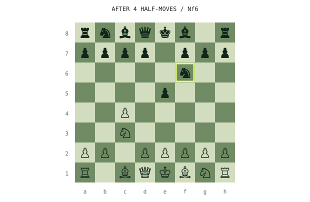</picture><table><tr><th>Turn</th><th>Played</th><th>Recorded search</th></tr><tr><td>1. White</td><td>c4</td><td>No search recorded</td></tr><tr><td>1… Black</td><td>e5</td><td>No search recorded</td></tr><tr><td>2. White</td><td>Nc3</td><td>No search recorded</td></tr><tr><td>2… Black</td><td>Nf6</td><td>No search recorded</td></tr></table>

<samp>CHAPTER 2 · MOVES 3–4</samp>

<picture><source media="(prefers-color-scheme: dark)" srcset="generated/replay-page-2-dark.svg">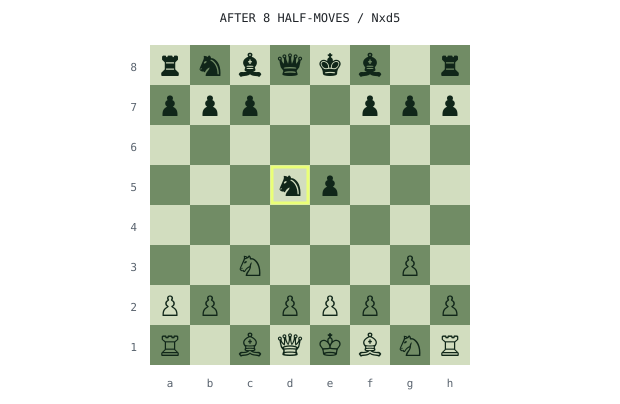</picture><table><tr><th>Turn</th><th>Played</th><th>Recorded search</th></tr><tr><td>3. White</td><td>g3</td><td>No search recorded</td></tr><tr><td>3… Black</td><td>d5</td><td>No search recorded</td></tr><tr><td>4. White</td><td>cxd5</td><td>No search recorded</td></tr><tr><td>4… Black</td><td>Nxd5</td><td>No search recorded</td></tr></table>

<samp>CHAPTER 3 · MOVES 5–6</samp>

<picture><source media="(prefers-color-scheme: dark)" srcset="generated/replay-page-3-dark.svg">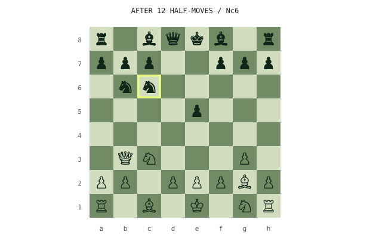</picture><table><tr><th>Turn</th><th>Played</th><th>Recorded search</th></tr><tr><td>5. White</td><td>Bg2</td><td>No search recorded</td></tr><tr><td>5… Black</td><td>Nb6</td><td>No search recorded</td></tr><tr><td>6. White</td><td>Qb3</td><td>4,087 nodes · depth 3</td></tr><tr><td>6… Black</td><td>Nc6</td><td>138 nodes · depth 2</td></tr></table>

<samp>CHAPTER 4 · MOVES 7–8</samp>

<picture><source media="(prefers-color-scheme: dark)" srcset="generated/replay-page-4-dark.svg">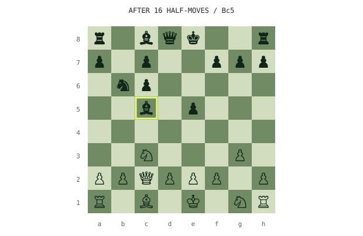</picture><table><tr><th>Turn</th><th>Played</th><th>Recorded search</th></tr><tr><td>7. White</td><td>Bxc6+</td><td>3,787 nodes · depth 3</td></tr><tr><td>7… Black</td><td>bxc6</td><td>2,403 nodes · depth 4</td></tr><tr><td>8. White</td><td>Qc2</td><td>1,358 nodes · depth 3</td></tr><tr><td>8… Black</td><td>Bc5</td><td>577 nodes · depth 3</td></tr></table>

<samp>CHAPTER 5 · MOVES 9–10</samp>

<picture><source media="(prefers-color-scheme: dark)" srcset="generated/replay-page-5-dark.svg">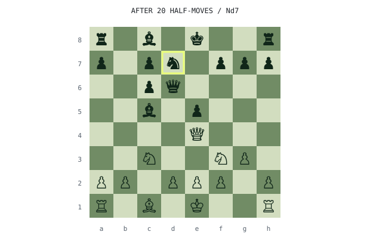</picture><table><tr><th>Turn</th><th>Played</th><th>Recorded search</th></tr><tr><td>9. White</td><td>Qe4</td><td>142 nodes · depth 3</td></tr><tr><td>9… Black</td><td>Qd6</td><td>734 nodes · depth 2</td></tr><tr><td>10. White</td><td>Nf3</td><td>130 nodes · depth 2</td></tr><tr><td>10… Black</td><td>Nd7</td><td>188 nodes · depth 2</td></tr></table>

<samp>CHAPTER 6 · MOVES 11–12</samp>

<picture><source media="(prefers-color-scheme: dark)" srcset="generated/replay-page-6-dark.svg">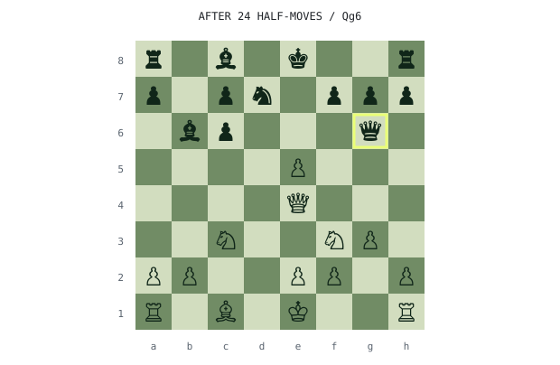</picture><table><tr><th>Turn</th><th>Played</th><th>Recorded search</th></tr><tr><td>11. White</td><td>d4</td><td>738 nodes · depth 2</td></tr><tr><td>11… Black</td><td>Bb6</td><td>152 nodes · depth 2</td></tr><tr><td>12. White</td><td>dxe5</td><td>156 nodes · depth 2</td></tr><tr><td>12… Black</td><td>Qg6</td><td>333 nodes · depth 2</td></tr></table>

Recorded source revision: daa903d73659.

<samp>THE LOGIC LILY PAD · THREE SMALL BRAINTEASERS</samp>

Think through a puzzle, then open its explanation.

<samp>01 · HOW MANY WAYS ACROSS THE POND?</samp>

A frog starts on pad 0 and wants to reach pad 4. It can hop forward by one or two pads. How many distinct sequences of hops reach pad 4 exactly?

<samp>REVEAL THE REASONING</samp>

<b>Five:</b> 1+1+1+1, 1+1+2, 1+2+1, 2+1+1, and 2+2.

Every route ends with a one-pad or two-pad hop, so ways(n) = ways(n−1) + ways(n−2). Start with ways(0) = 1 and ways(1) = 1.

<samp>02 · THE FIREFLY MESSAGE</samp>

Three fireflies can each be on or off. How many distinct patterns can they display, including all off?

<samp>REVEAL THE REASONING</samp>

<b>Eight.</b> Each light doubles the possibilities: 2 × 2 × 2. In binary: 000, 001, 010, 011, 100, 101, 110, 111.

Add one more firefly and there are 16 patterns.

<samp>03 · FIND THE HEAVIER PEBBLE</samp>

Eight pebbles look identical. Exactly one is heavier. With a balance scale, can you always find it in two weighings?

<samp>REVEAL THE REASONING</samp>

<b>Yes.</b> Weigh three against three. If they balance, weigh the two remaining pebbles against each other. Otherwise, take the heavier group of three and weigh one against another: the heavier one wins, or a balance identifies the third.

The three possible outcomes of a balance comparison let you narrow the candidates faster than a yes/no question.

<samp>THE SOUND MICROSCOPE · SCORE VS AUDIO</samp>

Zoom into four moments of the captured Minuet analysis. Compare patterns, make a prediction, then reveal the answer or inspect all twelve values.

<samp>WHAT AM I LOOKING AT?</samp>

Chroma groups pitches into the twelve pitch classes, ignoring octave. The left column comes from the known score; the right comes from analysis of the synthesized audio.

Longer bars mean stronger normalized evidence within that representation. They are not probabilities, loudness readings, or performance grades. The score and audio columns use their respective recorded normalizations.

These four frames are sampled near 0, 3, 6, and 9 seconds. They are individual snapshots, not averages across each three-second interval.

<samp>SNAPSHOT 1 · 0.00 SECONDS</samp>

Which pitch class has the longest bar on the audio side? How closely does its pattern resemble the known score?
<picture><source media="(prefers-color-scheme: dark)" srcset="generated/sound-frame-1-dark.svg">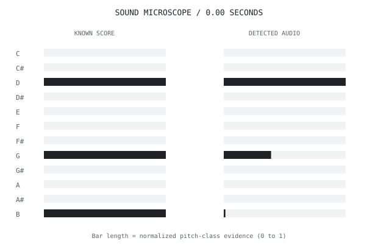</picture>

<samp>REVEAL THE STRONGEST PITCH CLASS</samp>

<b>D has the strongest recorded evidence.</b>

This is a pitch class, not a single note or octave. Several notes can share a pitch class, and harmonics can also contribute evidence.

<samp>INSPECT THE NUMBERS</samp>

<table><tr><th>Pitch class</th><th>Score evidence</th><th>Audio evidence</th></tr><tr><td>C</td><td>0.000</td><td>0.000</td></tr><tr><td>C#</td><td>0.000</td><td>0.000</td></tr><tr><td>D</td><td>1.000</td><td>1.000</td></tr><tr><td>D#</td><td>0.000</td><td>0.000</td></tr><tr><td>E</td><td>0.000</td><td>0.000</td></tr><tr><td>F</td><td>0.000</td><td>0.000</td></tr><tr><td>F#</td><td>0.000</td><td>0.000</td></tr><tr><td>G</td><td>1.000</td><td>0.388</td></tr><tr><td>G#</td><td>0.000</td><td>0.000</td></tr><tr><td>A</td><td>0.000</td><td>0.000</td></tr><tr><td>A#</td><td>0.000</td><td>0.000</td></tr><tr><td>B</td><td>1.000</td><td>0.014</td></tr></table>

<samp>SNAPSHOT 2 · 3.00 SECONDS</samp>

Which pitch class has the longest bar on the audio side? How closely does its pattern resemble the known score?
<picture><source media="(prefers-color-scheme: dark)" srcset="generated/sound-frame-2-dark.svg">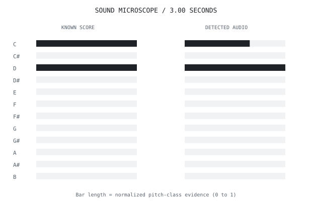</picture>

<samp>REVEAL THE STRONGEST PITCH CLASS</samp>

<b>D has the strongest recorded evidence.</b>

This is a pitch class, not a single note or octave. Several notes can share a pitch class, and harmonics can also contribute evidence.

<samp>INSPECT THE NUMBERS</samp>

<table><tr><th>Pitch class</th><th>Score evidence</th><th>Audio evidence</th></tr><tr><td>C</td><td>1.000</td><td>0.646</td></tr><tr><td>C#</td><td>0.000</td><td>0.000</td></tr><tr><td>D</td><td>1.000</td><td>1.000</td></tr><tr><td>D#</td><td>0.000</td><td>0.000</td></tr><tr><td>E</td><td>0.000</td><td>0.000</td></tr><tr><td>F</td><td>0.000</td><td>0.000</td></tr><tr><td>F#</td><td>0.000</td><td>0.000</td></tr><tr><td>G</td><td>0.000</td><td>0.000</td></tr><tr><td>G#</td><td>0.000</td><td>0.000</td></tr><tr><td>A</td><td>0.000</td><td>0.000</td></tr><tr><td>A#</td><td>0.000</td><td>0.000</td></tr><tr><td>B</td><td>0.000</td><td>0.000</td></tr></table>

<samp>SNAPSHOT 3 · 5.99 SECONDS</samp>

Which pitch class has the longest bar on the audio side? How closely does its pattern resemble the known score?
<picture><source media="(prefers-color-scheme: dark)" srcset="generated/sound-frame-3-dark.svg">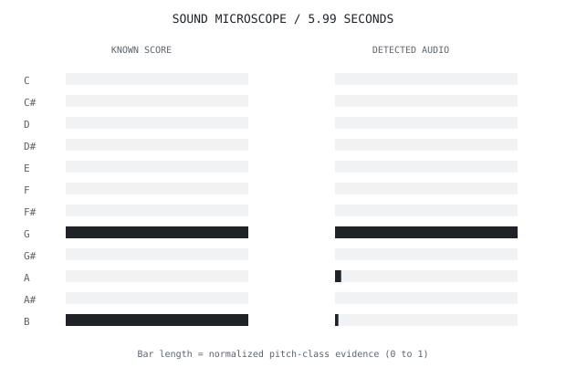</picture>

<samp>REVEAL THE STRONGEST PITCH CLASS</samp>

<b>G has the strongest recorded evidence.</b>

This is a pitch class, not a single note or octave. Several notes can share a pitch class, and harmonics can also contribute evidence.

<samp>INSPECT THE NUMBERS</samp>

<table><tr><th>Pitch class</th><th>Score evidence</th><th>Audio evidence</th></tr><tr><td>C</td><td>0.000</td><td>0.000</td></tr><tr><td>C#</td><td>0.000</td><td>0.000</td></tr><tr><td>D</td><td>0.000</td><td>0.000</td></tr><tr><td>D#</td><td>0.000</td><td>0.000</td></tr><tr><td>E</td><td>0.000</td><td>0.000</td></tr><tr><td>F</td><td>0.000</td><td>0.000</td></tr><tr><td>F#</td><td>0.000</td><td>0.000</td></tr><tr><td>G</td><td>1.000</td><td>1.000</td></tr><tr><td>G#</td><td>0.000</td><td>0.000</td></tr><tr><td>A</td><td>0.000</td><td>0.033</td></tr><tr><td>A#</td><td>0.000</td><td>0.000</td></tr><tr><td>B</td><td>1.000</td><td>0.018</td></tr></table>

<samp>SNAPSHOT 4 · 9.01 SECONDS</samp>

Which pitch class has the longest bar on the audio side? How closely does its pattern resemble the known score?
<picture><source media="(prefers-color-scheme: dark)" srcset="generated/sound-frame-4-dark.svg">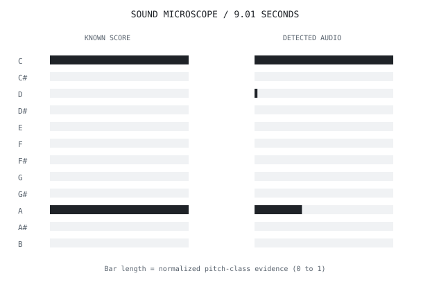</picture>

<samp>REVEAL THE STRONGEST PITCH CLASS</samp>

<b>C has the strongest recorded evidence.</b>

This is a pitch class, not a single note or octave. Several notes can share a pitch class, and harmonics can also contribute evidence.

<samp>INSPECT THE NUMBERS</samp>

<table><tr><th>Pitch class</th><th>Score evidence</th><th>Audio evidence</th></tr><tr><td>C</td><td>1.000</td><td>1.000</td></tr><tr><td>C#</td><td>0.000</td><td>0.000</td></tr><tr><td>D</td><td>0.000</td><td>0.021</td></tr><tr><td>D#</td><td>0.000</td><td>0.000</td></tr><tr><td>E</td><td>0.000</td><td>0.000</td></tr><tr><td>F</td><td>0.000</td><td>0.000</td></tr><tr><td>F#</td><td>0.000</td><td>0.000</td></tr><tr><td>G</td><td>0.000</td><td>0.000</td></tr><tr><td>G#</td><td>0.000</td><td>0.000</td></tr><tr><td>A</td><td>1.000</td><td>0.342</td></tr><tr><td>A#</td><td>0.000</td><td>0.000</td></tr><tr><td>B</td><td>0.000</td><td>0.000</td></tr></table>

<!-- profile-extras:end -->

<picture>
  <source media="(prefers-color-scheme: dark)" srcset="generated/hd-recent-dark.svg">
  
</picture>

<!-- recent-links:start -->
<a href="https://github.com/EthanChenHyland/FunChessEngine" title="Open FunChessEngine">
<picture>
  <source media="(prefers-color-scheme: dark)" srcset="generated/work-1-dark.svg">
  
</picture>
</a>

<samp>EXPLORE FunChessEngine</samp>

Classical chess engine and local analysis workstation, with an Electron desktop app and Python backend.

<b>Languages:</b> JavaScript · Python · HTML · CSS · Makefile · Shell

<b>Latest default-branch commit:</b> <a href="https://github.com/EthanChenHyland/FunChessEngine/commit/7e994e4a7f44126cf2161a69d5b859772c02159b">Publish cross-platform tagged releases</a> 2026-09-11 UTC

<b>Latest release:</b> <a href="https://github.com/EthanChenHyland/FunChessEngine/releases/tag/v1.1.0">v1.1.0</a> · 2026-09-11

<samp><a href="https://github.com/EthanChenHyland/FunChessEngine">Code</a> · <a href="https://github.com/EthanChenHyland/FunChessEngine/commits/main">Commits</a> · <a href="https://github.com/EthanChenHyland/FunChessEngine/releases">Releases</a> · <a href="https://github.com/EthanChenHyland/FunChessEngine/issues">Issues</a></samp>

<a href="https://github.com/EthanChenHyland/TowerLogic" title="Open TowerLogic">
<picture>
  <source media="(prefers-color-scheme: dark)" srcset="generated/work-2-dark.svg">
  
</picture>
</a>

<samp>EXPLORE TowerLogic</samp>

Computer vision and machine learning system for Clash Royale using PyTorch, YOLOv8, OpenCV, emulator control, and policy-based automated decision logic.

<b>Languages:</b> Python · Shell

<b>Latest default-branch commit:</b> <a href="https://github.com/EthanChenHyland/TowerLogic/commit/33ed84c8ba47a0a407af763c917128cfbc4a8e29">Fix stuck on Menu Issue</a> 2026-08-31 UTC

<samp><a href="https://github.com/EthanChenHyland/TowerLogic">Code</a> · <a href="https://github.com/EthanChenHyland/TowerLogic/commits/main">Commits</a> · <a href="https://github.com/EthanChenHyland/TowerLogic/releases">Releases</a> · <a href="https://github.com/EthanChenHyland/TowerLogic/issues">Issues</a></samp>

<a href="https://github.com/EthanChenHyland/the-great-prompt-off" title="Open the-great-prompt-off">
<picture>
  <source media="(prefers-color-scheme: dark)" srcset="generated/work-3-dark.svg">
  
</picture>
</a>

<samp>EXPLORE the-great-prompt-off</samp>

Full-stack AI prompt-evaluation platform built with Next.js, TypeScript, Supabase/Postgres, and OpenRouter for live structured-extraction challenges.

<b>Languages:</b> TypeScript · PLpgSQL · JavaScript · CSS

<b>Latest default-branch commit:</b> <a href="https://github.com/EthanChenHyland/the-great-prompt-off/commit/02b472c7a15143398f089dbd99fbf69cbb947f0c">Comprehensive passthrough of README and MIT license</a> 2026-08-30 UTC

<samp><a href="https://github.com/EthanChenHyland/the-great-prompt-off">Code</a> · <a href="https://github.com/EthanChenHyland/the-great-prompt-off/commits/main">Commits</a> · <a href="https://github.com/EthanChenHyland/the-great-prompt-off/releases">Releases</a> · <a href="https://github.com/EthanChenHyland/the-great-prompt-off/issues">Issues</a></samp>

<a href="https://github.com/EthanChenHyland/kitcoscraper" title="Open kitcoscraper">
<picture>
  <source media="(prefers-color-scheme: dark)" srcset="generated/work-4-dark.svg">
  
</picture>
</a>

<samp>EXPLORE kitcoscraper</samp>

Node.js/Puppeteer scraper developed for Carat Coin to automate recurring Kitco precious-metals price collection and CSV-based reporting.

<b>Languages:</b> JavaScript

<b>Latest default-branch commit:</b> <a href="https://github.com/EthanChenHyland/kitcoscraper/commit/09bf8caa781ae8a2df8e5cbb87110b7aa5577b99">Revise README for clarity and detail</a> 2026-08-30 UTC

<b>Latest release:</b> <a href="https://github.com/EthanChenHyland/kitcoscraper/releases/tag/v1.0.0">v1.0.0</a> · 2026-09-11

<samp><a href="https://github.com/EthanChenHyland/kitcoscraper">Code</a> · <a href="https://github.com/EthanChenHyland/kitcoscraper/commits/main">Commits</a> · <a href="https://github.com/EthanChenHyland/kitcoscraper/releases">Releases</a> · <a href="https://github.com/EthanChenHyland/kitcoscraper/issues">Issues</a></samp>

<!-- recent-links:end -->

<!-- project-index:start -->

<samp>BROWSE ALL 14 PROJECTS</samp>

Public, non-fork projects, grouped by primary language.

<ul>
<li><a href="https://github.com/EthanChenHyland/avoid.love-v2">avoid.love-v2</a> — CSS</li>
<li><a href="https://github.com/EthanChenHyland/avoid.love-v3">avoid.love-v3</a> — CSS</li>
<li><a href="https://github.com/EthanChenHyland/wifi-concierge-site">wifi-concierge-site</a> — HTML</li>
<li><a href="https://github.com/EthanChenHyland/avoid.love">avoid.love</a> — JavaScript</li>
<li><a href="https://github.com/EthanChenHyland/chatgpt-web">chatgpt-web</a> — JavaScript</li>
<li><a href="https://github.com/EthanChenHyland/FunChessEngine">FunChessEngine</a> — JavaScript</li>
<li><a href="https://github.com/EthanChenHyland/grok-electron">grok-electron</a> — JavaScript</li>
<li><a href="https://github.com/EthanChenHyland/kitcoscraper">kitcoscraper</a> — JavaScript</li>
<li><a href="https://github.com/EthanChenHyland/nitro-notes">nitro-notes</a> — JavaScript</li>
<li><a href="https://github.com/EthanChenHyland/outlook-electron">outlook-electron</a> — JavaScript</li>
<li><a href="https://github.com/EthanChenHyland/TowerLogic">TowerLogic</a> — Python</li>
<li><a href="https://github.com/EthanChenHyland/PianoMirRustPublic">PianoMirRustPublic</a> — Rust</li>
<li><a href="https://github.com/EthanChenHyland/avoid.love-v1">avoid.love-v1</a> — TypeScript</li>
<li><a href="https://github.com/EthanChenHyland/the-great-prompt-off">the-great-prompt-off</a> — TypeScript</li>
</ul>

<!-- project-index:end -->

<samp>WATCH THE PROJECTS IN MOTION</samp>

<picture>
  <source media="(prefers-color-scheme: dark)" srcset="generated/demo-chess-dark.svg">
  
</picture>

<picture>
  <source media="(prefers-color-scheme: dark)" srcset="generated/demo-piano-dark.svg">
  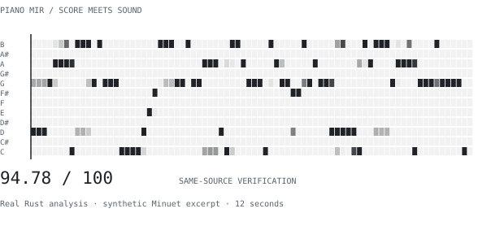
</picture>

<a href="https://www.ethanbchen.com/github/#demos">Play, pause, listen, and explore the demos ↗</a>

<picture>
  <source media="(prefers-color-scheme: dark)" srcset="generated/hd-stack-dark.svg">
  
</picture>

<picture>
  <source media="(prefers-color-scheme: dark)" srcset="generated/langs-dark.svg">
  
</picture>

<picture>
  <source media="(prefers-color-scheme: dark)" srcset="generated/atlas-dark.svg">
  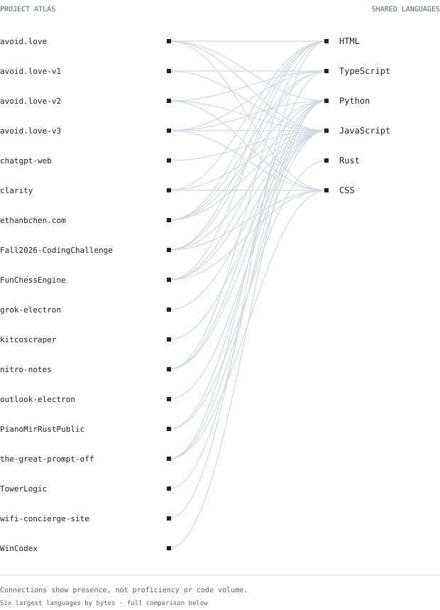
</picture>

<!-- comparison:start -->

<samp>COMPARE THE PROJECTS</samp>

<table>
<tr><th>Project</th><th>Languages by code size</th><th>Last push · UTC</th><th>Status</th></tr>
<tr><td><a href="https://github.com/EthanChenHyland/avoid.love">avoid.love</a></td><td>JavaScript · HTML · Python · CSS</td><td>2026-09-12</td><td>Open</td></tr>
<tr><td><a href="https://github.com/EthanChenHyland/avoid.love-v1">avoid.love-v1</a></td><td>TypeScript · JavaScript</td><td>2026-09-12</td><td>Open</td></tr>
<tr><td><a href="https://github.com/EthanChenHyland/avoid.love-v2">avoid.love-v2</a></td><td>CSS · TypeScript · JavaScript</td><td>2026-09-12</td><td>Open</td></tr>
<tr><td><a href="https://github.com/EthanChenHyland/avoid.love-v3">avoid.love-v3</a></td><td>CSS · TypeScript · Python · JavaScript</td><td>2026-09-12</td><td>Open</td></tr>
<tr><td><a href="https://github.com/EthanChenHyland/chatgpt-web">chatgpt-web</a></td><td>JavaScript · Swift</td><td>2026-09-12</td><td>Open</td></tr>
<tr><td><a href="https://github.com/EthanChenHyland/FunChessEngine">FunChessEngine</a></td><td>JavaScript · Python · HTML · CSS · Makefile · Shell</td><td>2026-09-11</td><td>Open</td></tr>
<tr><td><a href="https://github.com/EthanChenHyland/grok-electron">grok-electron</a></td><td>JavaScript · Swift</td><td>2026-09-12</td><td>Open</td></tr>
<tr><td><a href="https://github.com/EthanChenHyland/kitcoscraper">kitcoscraper</a></td><td>JavaScript</td><td>2026-09-11</td><td>Open</td></tr>
<tr><td><a href="https://github.com/EthanChenHyland/nitro-notes">nitro-notes</a></td><td>JavaScript · HTML · Python</td><td>2026-09-12</td><td>Open</td></tr>
<tr><td><a href="https://github.com/EthanChenHyland/outlook-electron">outlook-electron</a></td><td>JavaScript</td><td>2026-09-12</td><td>Open</td></tr>
<tr><td><a href="https://github.com/EthanChenHyland/PianoMirRustPublic">PianoMirRustPublic</a></td><td>Rust · Python</td><td>2026-08-30</td><td>Open</td></tr>
<tr><td><a href="https://github.com/EthanChenHyland/the-great-prompt-off">the-great-prompt-off</a></td><td>TypeScript · PLpgSQL · JavaScript · CSS</td><td>2026-08-30</td><td>Open</td></tr>
<tr><td><a href="https://github.com/EthanChenHyland/TowerLogic">TowerLogic</a></td><td>Python · Shell</td><td>2026-08-31</td><td>Open</td></tr>
<tr><td><a href="https://github.com/EthanChenHyland/wifi-concierge-site">wifi-concierge-site</a></td><td>HTML</td><td>2026-08-30</td><td>Open</td></tr>
</table>

<!-- comparison:end -->

<picture>
  <source media="(prefers-color-scheme: dark)" srcset="generated/hd-stats-dark.svg">
  
</picture>

<picture>
  <source media="(prefers-color-scheme: dark)" srcset="generated/pulse-dark.svg">
  
</picture>

<picture>
  <source media="(prefers-color-scheme: dark)" srcset="generated/streak-dark.svg">
  
</picture>

<picture>
  <source media="(prefers-color-scheme: dark)" srcset="generated/year-dark.svg">
  
</picture>

<picture>
  <source media="(prefers-color-scheme: dark)" srcset="generated/milestones-dark.svg">
  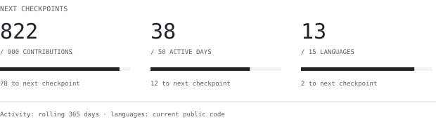
</picture>

<samp>EXPLORE THE NUMBERS</samp>

<!-- activity-text:start -->
274 contributions across 25 active days. Best Sunday–Saturday week: 86 contributions. 2025-09-13 through 2026-09-12, UTC.

Current: 2 days (2026-09-11 / 2026-09-12). Longest within the last 365 days: 6 days (2026-08-29 / 2026-09-03).

Last 7 UTC days: 34 contributions; previous 7 days: 86; last 30 days: 160 contributions over 15 active days. Includes today, which is unfinished.

contributions: 274, next checkpoint 300; active days: 25, next checkpoint 50; languages: 10, next checkpoint 15. Activity uses the rolling 365-day window; language count uses current public code. These are automatic numeric checkpoints, not GitHub awards.

**Languages**

- HTML: 3,853,377 bytes (45.8%), 4 repositories
- Python: 1,410,528 bytes (16.8%), 6 repositories
- Rust: 1,124,399 bytes (13.4%), 1 repositories
- JavaScript: 832,619 bytes (9.9%), 11 repositories
- TypeScript: 831,630 bytes (9.9%), 4 repositories
- CSS: 321,141 bytes (3.8%), 5 repositories
- PLpgSQL: 33,322 bytes (0.4%), 1 repositories
- Swift: 3,742 bytes (0.0%), 2 repositories
- Makefile: 2,330 bytes (0.0%), 1 repositories
- Shell: 1,335 bytes (0.0%), 2 repositories

**Featured work**

**FunChessEngine** (JavaScript), pushed 2026-09-11. Classical chess engine and local analysis workstation, with an Electron desktop app and Python backend.

**TowerLogic** (Python), pushed 2026-08-31. Computer vision and machine learning system for Clash Royale using PyTorch, YOLOv8, OpenCV, emulator control, and policy-based automated decision logic.

**the-great-prompt-off** (TypeScript), pushed 2026-08-30. Full-stack AI prompt-evaluation platform built with Next.js, TypeScript, Supabase/Postgres, and OpenRouter for live structured-extraction challenges.

**kitcoscraper** (JavaScript), pushed 2026-09-11. Node.js/Puppeteer scraper developed for Carat Coin to automate recurring Kitco precious-metals price collection and CSV-based reporting.
<!-- activity-text:end -->

[Daily contribution data](generated/activity.json)

